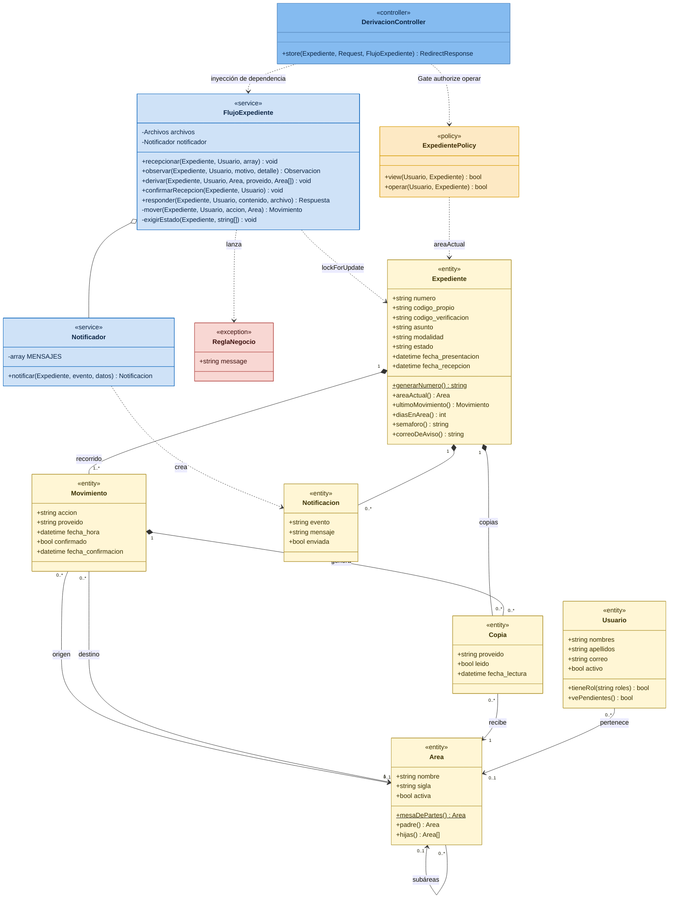
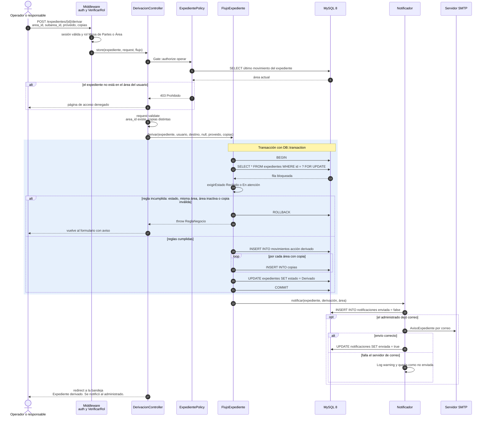

# C4 Nivel 4: Diagrama de código

## 1. Objetivo

Mostrar las clases que participan en el flujo principal del expediente.

## 2. Diagrama de clases

### 2.1. Capas
Control (`DerivacionController`, `ExpedientePolicy`) → Servicios (`FlujoExpediente`, `Notificador`, `Archivos`) → Datos (modelos).

### 2.2. Diagrama UML de clases

```mermaid
classDiagram
    direction TB
    class DerivacionController {
        <<controller>>
        +store(Expediente, Request, FlujoExpediente) RedirectResponse
    }
    class ExpedientePolicy {
        <<policy>>
        +view(Usuario, Expediente) bool
        +operar(Usuario, Expediente) bool
    }
    class FlujoExpediente {
        <<service>>
        -Archivos archivos
        -Notificador notificador
        +recepcionar(Expediente, Usuario, array) void
        +observar(Expediente, Usuario, motivo, detalle) Observacion
        +derivar(Expediente, Usuario, Area, proveido, Area[]) void
        +confirmarRecepcion(Expediente, Usuario) void
        +responder(Expediente, Usuario, contenido, archivo) Respuesta
        -mover(Expediente, Usuario, accion, Area) Movimiento
        -exigirEstado(Expediente, string[]) void
    }
    class Notificador {
        <<service>>
        -array MENSAJES
        +notificar(Expediente, evento, datos) Notificacion
    }
    class ReglaNegocio {
        <<exception>>
        +string message
    }
    class Expediente {
        <<entity>>
        +string numero
        +string codigo_propio
        +string codigo_verificacion
        +string asunto
        +string modalidad
        +string estado
        +datetime fecha_presentacion
        +datetime fecha_recepcion
        +generarNumero()$ string
        +areaActual() Area
        +ultimoMovimiento() Movimiento
        +diasEnArea() int
        +semaforo() string
        +correoDeAviso() string
    }
    class Movimiento {
        <<entity>>
        +string accion
        +string proveido
        +datetime fecha_hora
        +bool confirmado
        +datetime fecha_confirmacion
    }
    class Copia {
        <<entity>>
        +string proveido
        +bool leido
        +datetime fecha_lectura
    }
    class Area {
        <<entity>>
        +string nombre
        +string sigla
        +bool activa
        +mesaDePartes()$ Area
        +padre() Area
        +hijas() Area[]
    }
    class Usuario {
        <<entity>>
        +string nombres
        +string apellidos
        +string correo
        +bool activo
        +tieneRol(string roles) bool
        +vePendientes() bool
    }
    class Notificacion {
        <<entity>>
        +string evento
        +string mensaje
        +bool enviada
    }
    DerivacionController ..> ExpedientePolicy : Gate authorize operar
    DerivacionController ..> FlujoExpediente : inyección de dependencia
    FlujoExpediente o-- Notificador
    FlujoExpediente ..> ReglaNegocio : lanza
    FlujoExpediente ..> Expediente : lockForUpdate
    Notificador ..> Notificacion : crea
    ExpedientePolicy ..> Expediente : areaActual
    Expediente "1" *-- "1..*" Movimiento : recorrido
    Expediente "1" *-- "0..*" Copia : copias
    Expediente "1" *-- "0..*" Notificacion
    Movimiento "0..*" --> "0..1" Area : origen
    Movimiento "0..*" --> "1" Area : destino
    Movimiento "1" *-- "0..*" Copia : genera
    Copia "0..*" --> "1" Area : recibe
    Usuario "0..*" --> "0..1" Area : pertenece
    Area "0..1" <-- "0..*" Area : subáreas
    style DerivacionController fill:#85bbf0,stroke:#5d8fc4,color:#0b2545
    style ExpedientePolicy fill:#fde9c4,stroke:#d79b00,color:#3d2c00
    style FlujoExpediente fill:#cfe2f7,stroke:#1168bd,color:#0b2545
    style Notificador fill:#cfe2f7,stroke:#1168bd,color:#0b2545
    style ReglaNegocio fill:#f8d7d3,stroke:#b85450,color:#3d0f0c
    style Expediente fill:#fff6d5,stroke:#b59a3c,color:#3a3000
    style Movimiento fill:#fff6d5,stroke:#b59a3c,color:#3a3000
    style Copia fill:#fff6d5,stroke:#b59a3c,color:#3a3000
    style Area fill:#fff6d5,stroke:#b59a3c,color:#3a3000
    style Usuario fill:#fff6d5,stroke:#b59a3c,color:#3a3000
    style Notificacion fill:#fff6d5,stroke:#b59a3c,color:#3a3000
```

### 2.3. Notación
Flecha continua: asociación o uso. Flecha punteada: dependencia. `1 → *`: uno a muchos.

## 3. Diagrama de secuencia: derivar expediente

### 3.1. Descripción
Ver el flujo detallado en [diseño interno](../03-diseno-de-software/diseno-interno/diseno-interno-de-modulos.md#7-flujo-de-ejecución-de-un-caso-de-uso-cu10-derivar).

### 3.2. Diagrama

```mermaid
sequenceDiagram
    autonumber
    actor Op as Operador o responsable
    participant MW as Middleware<br/>auth y VerificarRol
    participant C as DerivacionController
    participant P as ExpedientePolicy
    participant F as FlujoExpediente
    participant DB as MySQL 8
    participant N as Notificador
    participant SMTP as Servidor SMTP

    Op->>MW: POST /expedientes/{id}/derivar<br/>area_id, subarea_id, proveido, copias
    MW->>MW: sesión válida y rol Mesa de Partes o Área
    MW->>C: store(expediente, request, flujo)
    C->>P: Gate::authorize operar
    P->>DB: SELECT último movimiento del expediente
    DB-->>P: área actual
    alt el expediente no está en el área del usuario
        P-->>C: 403 Prohibido
        C-->>Op: página de acceso denegado
    end
    C->>C: request validate<br/>area_id existe, copias distintas
    C->>F: derivar(expediente, usuario, destino, null, proveido, copias)
    rect rgb(230, 240, 252)
        Note over F,DB: Transacción con DB::transaction
        F->>DB: BEGIN
        F->>DB: SELECT * FROM expedientes WHERE id = ? FOR UPDATE
        DB-->>F: fila bloqueada
        F->>F: exigirEstado Recibido o En atención
        alt regla incumplida: estado, misma área, área inactiva o copia inválida
            F->>DB: ROLLBACK
            F-->>C: throw ReglaNegocio
            C-->>Op: vuelve al formulario con aviso
        else reglas cumplidas
            F->>DB: INSERT INTO movimientos acción derivado
            loop por cada área con copia
                F->>DB: INSERT INTO copias
            end
            F->>DB: UPDATE expedientes SET estado = Derivado
            F->>DB: COMMIT
        end
    end
    F->>N: notificar(expediente, derivación, área)
    N->>DB: INSERT INTO notificaciones enviada = false
    opt el administrado dejó correo
        N->>SMTP: AvisoExpediente por correo
        alt envío correcto
            N->>DB: UPDATE notificaciones SET enviada = true
        else falla el servidor de correo
            N->>N: Log warning y queda como no enviada
        end
    end
    C-->>Op: redirect a la bandeja<br/>Expediente derivado. Se notificó al administrado.
```

## 4. Patrones y principios en este nivel

Service Layer, Policy, Active Record, inyección de dependencias y responsabilidad única (ver [patrones](../03-diseno-de-software/diseno-interno/patrones-de-diseno.md)).

## 5. Consideraciones

Estos diagramas corresponden a la Fig 54 (clases) y a la secuencia del CU10 del análisis ICONIX.
